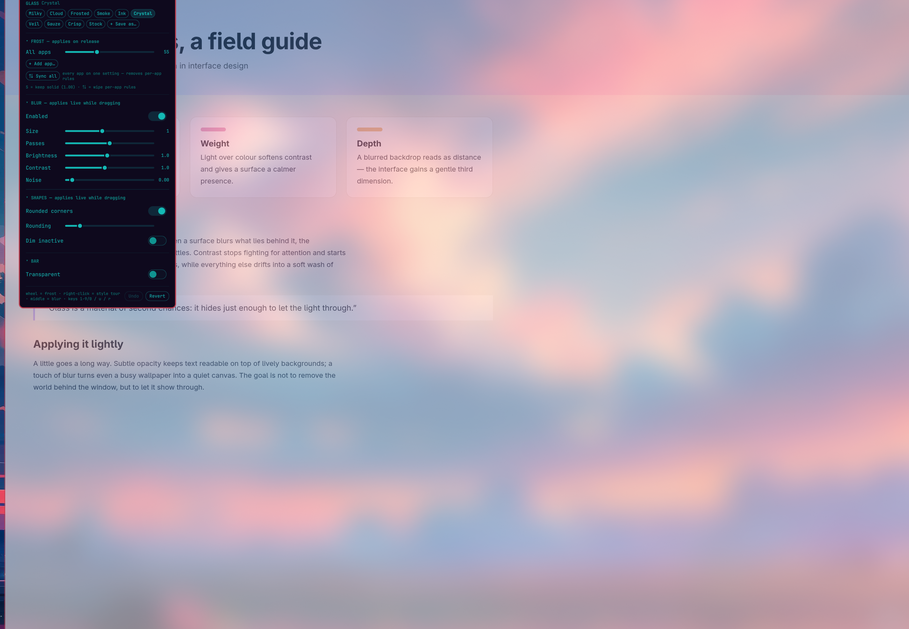

# Glass (khwan.glass)

Milky-glass control panel for the [Omarchy](https://omarchy.org) bar: frosted
window opacity, compositor blur, rounding, and dim — sliders in the bar with
live-apply while dragging.



## Install

```sh
omarchy plugin add https://github.com/Khwan888/khwan.glass.git --enable
```

Omarchy clones the current upstream repository, validates it locally, and only
then installs and enables the plugin.

## Remove

```sh
omarchy plugin remove khwan.glass --yes
```

Removal deletes the plugin checkout. To restore the stock look, pick
**Stock** in the panel (`0`) or run `scripts/glass-ctl preset stock` *before*
removing. If you remove without doing that, these stay behind: the managed
block in `~/.config/hypr/looknfeel.lua`, the state file
`~/.local/state/omarchy/glass.json`, and the rolling backups
`looknfeel.lua.bak.*` (newest 10). Clearing the block or restoring a backup
brings stock back later.

## What it writes

Nothing is written until *you* change a setting.

- The first slider move (or preset, sync, corners switch) splices a **managed
  block** between `-- BEGIN/END khwan.glass` markers in
  `~/.config/hypr/looknfeel.lua`. Only that block is ever touched, and every
  write takes a `.bak` copy first.
- If the file had a hand-written "milky glass" section from before the
  plugin, it is adopted on that first write: values are read into the panel,
  and the old lines are trimmed only when they contain nothing but glass
  settings — otherwise the file is left exactly as it was and the block is
  appended at the end.
- State, including your saved presets, lives in
  `~/.local/state/omarchy/glass.json`.

## Features

- **10 styles** — Milky · Cloud · Frosted · Smoke · Ink · Crystal · Veil ·
  Gauze · Crisp · Stock. The panel shows which one the current look matches,
  or **Custom**.
- **⇅ Sync all** — drop every per-app rule so all windows follow "All apps".
  Undoable.
- **FROST** — global and per-app window opacity; release-apply rewrites the
  block and reloads so open windows re-frost. Keep a window solid with `S`.
- **BLUR** — on/off, size, passes, brightness, contrast, noise — live while
  dragging.
- **SHAPES** — square/rounded corners switch, rounding, dim-inactive and
  strength.
- **BAR** — transparent bar toggle.
- **Undo stack** (session) and **Revert** (restores the newest backup).
- **Style tour** — right-click the icon: Cloud → Smoke → Ink → Crystal →
  Milky, with a 10-second keep-or-revert trial.
- **User presets** — save any look under your own name; it appears as a chip.

## Bar icon gestures

click = panel · wheel = frost ±0.05 · right-click = style tour · middle-click = blur on/off

Panel keys: `1-9` + `0` styles (0 = Stock) · `u` undo · `r` revert

## Requirements

- Omarchy (Quattro) with Hyprland.
- `python3` (standard library only — nothing extra to install) and `hyprctl`,
  both already on Omarchy.
- User space only: no elevated permissions, no daemon, no network access.

## CLI

The panel is a front-end for `scripts/glass-ctl`:

```
glass-ctl get | readback | set '<json>' | live '<json>' | frost '<json>'
        | persist '<json>' | preset <name> | savepreset '<name>'
        | delpreset '<name>' | sync | round true|false|toggle
        | revert | classes | bar true|false|toggle | init
```

Responses are JSON carrying `state`, `active` (matched style or null), `user`,
and `tour`. IPC (same actions):

```
quickshell -p /usr/share/omarchy/shell ipc call khwan.glass open|close|toggle
```

## Files

- `Glass.qml` — bar widget and panel UI
- `GlassIcon.qml` — canvas-drawn frosted-square glyph
- `Service.qml` — startup adoption and IPC (`khwan.glass.service`)
- `WheelSafeSlider.qml` — wheel-safe slider (see Credits)
- `scripts/glass-ctl` — state, Lua block generation, hyprctl apply, presets
- `tests/` — golden and smoke suites: `bash tests/run.sh`

## Credits

- `WheelSafeSlider.qml` is adapted from the `im0001gt.screens` plugin (MIT).

## License

MIT — see [LICENSE](LICENSE).
